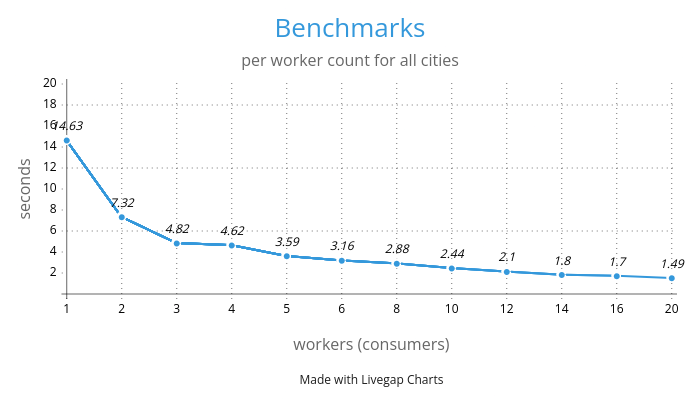
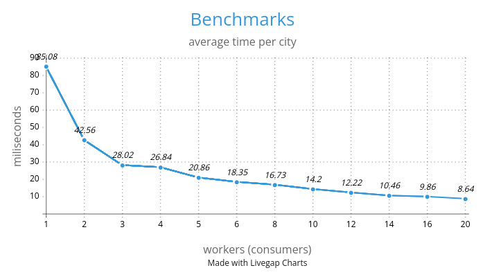

# meteo-analyser

Given the input city data, analyse the weather using [Open-Meteo](https://open-meteo.com/en/docs) API and provide the output `results.json` file with the following information:

- city with the highest mean temperature
- city that has mist most often
- city that has a clear sky most often

Weather is analysed between dates: `2024-04-01` - `2024-09-30`

Results:

```json
{
    "highest_mean_temperature_city": "Nowa Sól",
    "most_mist_city": "No city had mist",
    "most_clear_sky_city": "Białystok"
}
```

## Usage

```bash
go run ./cmd/. -help  # show help

# provide input file and number of workers
go run ./cmd/. -input data/pl172.json -workers 2

# provide all possible arguments
go run ./cmd/. -input data/pl172.json -output results.json -workers 2 -buffer 200
```

## Testing

```bash
# run unit tests
go test ./cmd/...

# run unit tests with benchmarks
# WARNING: automated benchmarks use real Open-Meteo API and will be rate limited after some point
go test ./cmd/... -bench=.
```

## Benchmarks

### Automated

Automated benchmarks for 1 month of data with 172 cities:

```bash
cpu: AMD Ryzen 7 PRO 6850U with Radeon Graphics
BenchmarkCollectResponses_Workers/1-workers_-16                        1        11674862723 ns/op
BenchmarkCollectResponses_Workers/2-workers_-16                        1        5864503966 ns/op
BenchmarkCollectResponses_Workers/3-workers_-16                        1        3948348865 ns/op
BenchmarkCollectResponses_Workers/4-workers_-16                        1        3181198702 ns/op
BenchmarkCollectResponses_Workers/6-workers_-16                        1        2177568725 ns/op
BenchmarkCollectResponses_Workers/8-workers_-16                        1        1974210010 ns/op
BenchmarkCollectResponses_Workers/10-workers_-16                       1        1571701578 ns/op
BenchmarkCollectResponses_Workers/12-workers_-16                       1        10755149274 ns/op
BenchmarkCollectResponses_Workers/14-workers_-16                       1        1302916754 ns/op
BenchmarkCollectResponses_Workers/16-workers_-16                       1        1052835566 ns/op
BenchmarkCollectResponses_Workers/20-workers_-16                       1        1038317792 ns/op
```


| Workers | Time (seconds) | Relative Speed |
|--------:|---------------:|--------------:|
| 1 | 11.67 | 1x (baseline) |
| 2 | 5.86 | 1.99x faster |
| 3 | 3.95 | 2.95x faster |
| 4 | 3.18 | 3.67x faster |
| 6 | 2.18 | 5.35x faster |
| 8 | 1.97 | 5.91x faster |
| 10 | 1.57 | 7.43x faster |
| 12 | 10.76 | 1.08x faster* |
| 14 | 1.30 | 8.97x faster |
| 16 | 1.05 | 11.09x faster |
| 20 | 1.04 | 11.24x faster |

### Manual

Manual benchmarks for 6 months of data with 172 cities:






| Workers | Execution Time (s) | Average Time per City (ms) |
|--------:|------------------:|-------------------------:|
| 1 | 14.63 | 85.08 |
| 2 | 7.32 | 42.56 |
| 3 | 4.82 | 28.02 |
| 4 | 4.62 | 26.84 |
| 5 | 3.59 | 20.86 |
| 6 | 3.16 | 18.35 |
| 8 | 2.88 | 16.73 |
| 10 | 2.44 | 14.20 |
| 12 | 2.10 | 12.22 |
| 14 | 1.80 | 10.46 |
| 16 | 1.70 | 9.86 |
| 20 | 1.49 | 8.64 |
